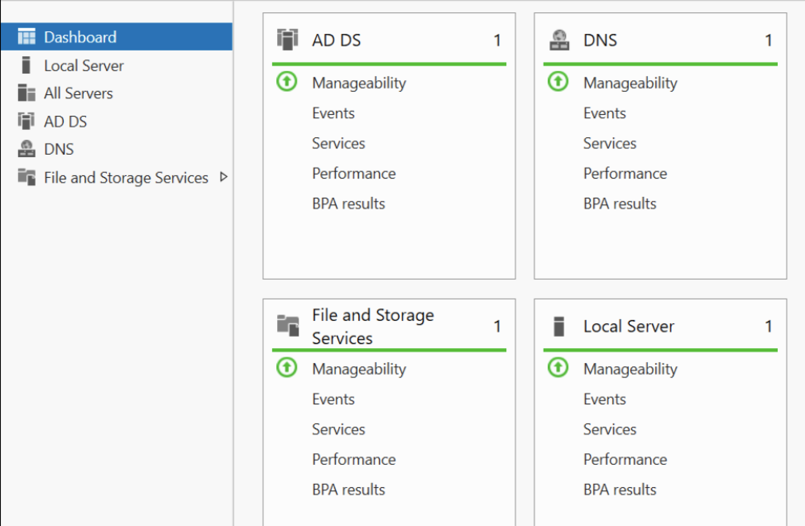
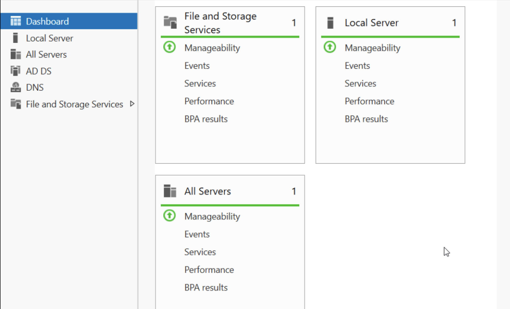
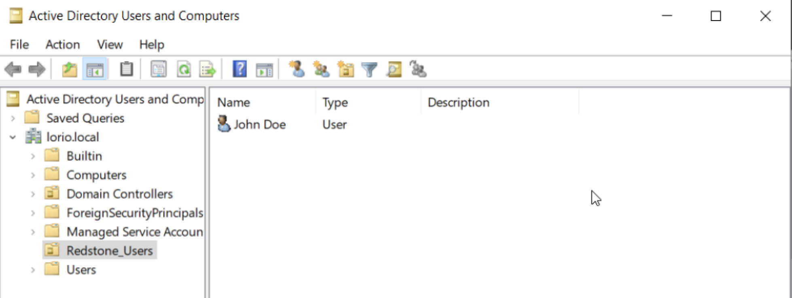
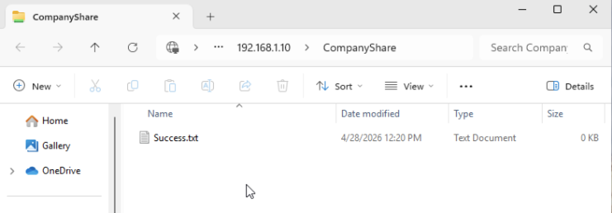
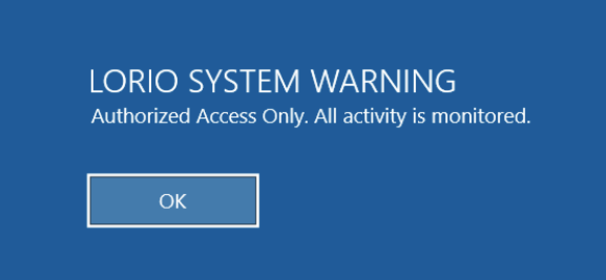

# Windows-Server-2022-Home-Lab
A virtualized corporate network environment featuring Active Directory Domain Services, DNS configuration, and Windows 11 client integration. Used for personal learning.

# Windows Server 2022 Active Directory Home Lab
**Enterprise Infrastructure Simulation & User Lifecycle Management**

## 🌐 Project Overview
This project demonstrates the deployment and configuration of a localized Windows Server 2022 environment. The goal was to simulate a corporate infrastructure that manages centralized user authentication, automated resource provisioning, and enforceable security policies.

### 🛠️ Core Technologies
* **Hypervisor:** VMware Fusion (MacOS)
* **Server OS:** Windows Server 2022 (Domain Controller)
* **Client OS:** Windows 11 Enterprise
* **Directory Services:** Active Directory Domain Services (AD DS)
* **Protocol/Policy:** Group Policy Objects (GPO), DNS, SMB/NTFS Permissions

## 🚀 Key Features Implemented
* **Active Directory Architecture:** Established the `lorio.local` domain with custom Organizational Units (OUs) for streamlined user management.

* **Automated Provisioning:** Implemented GPO-driven network drive mapping (S: Drive) for department-wide resource sharing.

* **Security Enforcement:** Configured Interactive Logon Banners via Group Policy to meet corporate legal compliance standards.

* **Resource Security:** Managed tiered NTFS and Share permissions to ensure data integrity and the principle of least privilege.
